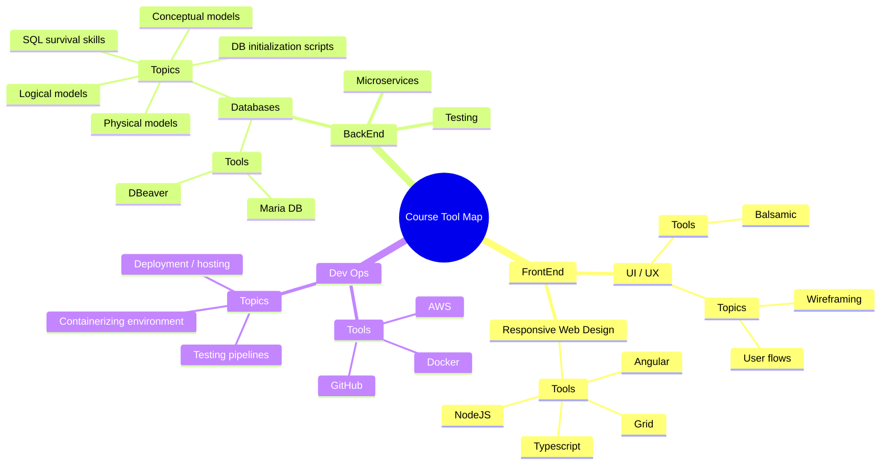

```mermaid
mindmap
  root((Course Tool Map))
    FrontEnd
      UI / UX
        Tools
          Balsamic
        Topics
          User flows
          Wireframing
      Responsive Web Design
        Tools
          Angular
          Grid
          Typescript
          NodeJS
    BackEnd
      Databases
        Tools
          Maria DB
          DBeaver
        Topics
          Conceptual models
          Logical models
          Physical models
          DB initialization scripts
          SQL survival skills
      Microservices
      Testing
    Dev Ops
        Tools
          GitHub
          Docker
          AWS
        Topics
          Containerizing environment
          Testing pipelines
          Deployment / hosting
```
